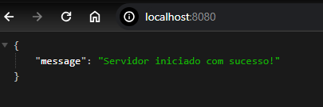

# Teste Back-end TempoCerto

### Tecnologias Utilizadas

O projeto foi desenvolvido utilizando as seguintes tecnologias:

1. **Golang:**
   - Linguagem de programação principal.

2. **MySQL/MariaDB:**
   - Sistema de gerenciamento de banco de dados.

### Uso da API Receita WS

Integrei a API [Receita WS](https://developers.receitaws.com.br/#/operations/queryCNPJFree) para consultar o CNPJ e obter a razão social da empresa na rota de listagem das agendas. Essa integração adiciona informações valiosas ao sistema, proporcionando uma experiência mais completa para os usuários.


# Informações sobre Utilização:

1. Clone o repositório.
   
   ```bash
   git@github.com:MelvimJones/Teste-back-end-TempoCerto.git
   ```

2. Configure as opções em `config.go`.
3. Execute o script `database.go` para inicializar o banco de dados.
4. Abra o terminal na pasta do seu projeto.

5. Execute os seguintes comandos:


   ```bash
   go run main.go
   ```

6. Isso iniciará o servidor, e você verá as mensagens de inicialização no console.
   
7. "Para verificar o funcionamento do servidor, acesse http://localhost:8080/ em seu navegador. Você verá uma mensagem indicando que o servidor está operacional."
  
> Certifique-se de ter o Go instalado no seu sistema e que as dependências do projeto foram resolvidas com `go mod tidy` antes de tentar executar o código.


### Estrutura de Arquivos

#### 1. `config.go`

O arquivo `config.go` contém configurações essenciais para o projeto. Ajuste as seguintes configurações conforme necessário:

- `ServerPort`: Porta em que o servidor será executado.
- `DatabaseURL`: URL de conexão com o banco de dados.

#### 2. `database.go`

`database.go` define a lógica de conexão e inicialização do banco de dados.

#### 3. `agendamento_handler.go`

`agendamento_handler.go` contém manipuladores HTTP relacionados ao agendamento.

### Funcionalidades

#### 1. Solicitar Agendamento

Envie uma requisição POST para a rota `/agendas` com um JSON contendo as informações do agendamento.

**Endpoint:**
> [POST] /agendas

**Exemplo de Requisição:**

```json
{
    "empresa": {
        "cnpj": "26488705000193"
    },
    "horario": "10:00"
}
```

#### 2. Listar Agendas

Faça uma requisição GET para a rota `/agendas` para listar todas as agendas.

**Endpoint:**
> [GET] /agendas

**Exemplo de Resposta:**

```json
[
    {
        "horario": "10:00",
        "empresa": {
            "cnpj":"26488705000193",
            ...
        },
    }
]
```

#### 3. Verificar Disponibilidade de Horários

Faça uma requisição GET para a rota `/agendas:disponibilidade` para verificar a disponibilidade de horários.

**Endpoint:**
> [GET] /agendas:disponibilidade

**Exemplo de Resposta:**

```json
[
    {
        "inicio":"8:00",
        "fim":"9:00",
        "disponivel": true
    },
    {
        "inicio":"9:00",
        "fim":"10:00",
        "disponivel": false
    }
]
```

